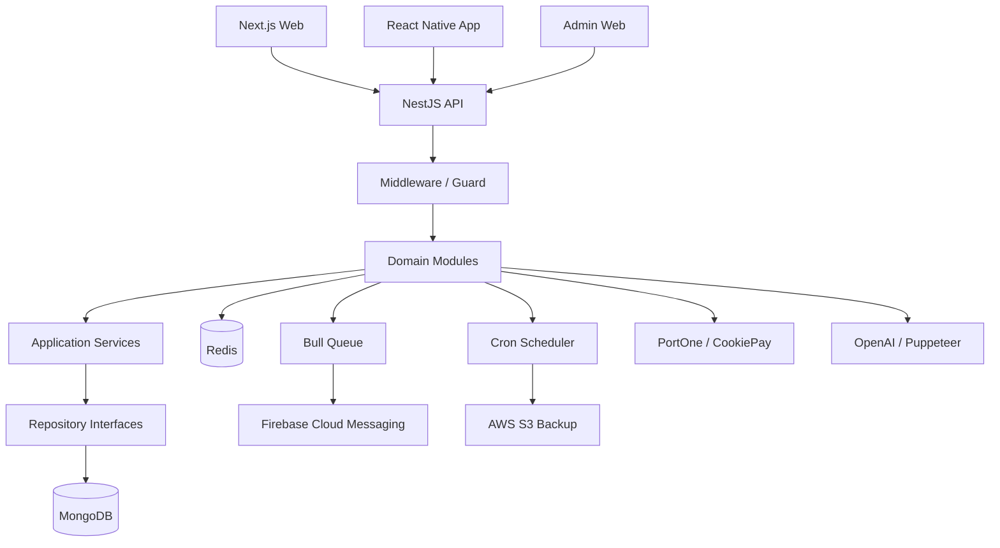

# ABOUT Backend

> 대학생·취업 전 20대의 공부, 취미, 친목 활동을 연결하는 **ABOUT 서비스의 NestJS 백엔드**입니다.

본 저장소는 ABOUT과 카공지도의 회원·인증, 모임, 소모임, 스터디 자동 매칭, 포인트·결제, 알림, 관리자 기능과 운영 자동화를 담당합니다.

2023년 Express.js 기반으로 시작했으며, 서비스 규모와 도메인이 확장됨에 따라 2024년 10월 NestJS로 이전했습니다.

- Web: [about20s.club](https://about20s.club)
- Cafe Map: [카공지도.com](https://카공지도.com)
- Frontend: [AboutClan/About](https://github.com/AboutClan/About)
- React Native App: [AboutClan/app](https://github.com/AboutClan/app)
- Instagram: [@about._.20s](https://www.instagram.com/about._.20s)

---

## Service Overview

ABOUT은 대학생과 취업 전 20대가 원하는 순간에 공부·취미·문화생활을 함께할 사람과 활동을 찾을 수 있도록 만든 커뮤니티 서비스입니다.

백엔드는 사용자의 가입부터 활동 이후 정산까지 이어지는 전체 흐름을 처리합니다.

```text
소셜 로그인·본인인증
→ 가입 신청·관리자 승인
→ 모임·소모임·스터디 참여
→ 출석·후기·평판 데이터 축적
→ 포인트·참여권·페널티 정산
→ 푸시 알림·재참여
```

### 주요 운영 지표

2026년 7월 기준입니다.

| 지표 | 값 |
| --- | ---: |
| 누적 가입자 | 8,000명 |
| 누적 유료 가입자 | 5,000명 |
| 월간 활동 인원 | 600명 |
| 월간 모임 | 100회 |
| 자동 매칭 스터디 처리 인원 | 월 약 200명 |
| 카공지도의 등록 장소 | 약 1,000곳 |
| 카공지도의 평시 하루 평균 방문자 | 약 4,000명 |
| 카공지도의 하루 최대 방문자 | 약 25,000명 |

---

## Core Domains

### 회원·인증

- 카카오·애플 OAuth 로그인
- 게스트 로그인과 정식 회원 전환
- NICE 휴대폰 본인인증
- 실명·전화번호·연령 확인
- 동일 전화번호·소셜 계정 중복 가입 방지
- 20대 연령 제한
- 가입 신청과 관리자 승인
- 가입 단계별 상태 관리
- 승인 시 초기 포인트·참여권·등급 지급
- JWT 검증과 역할 기반 접근 제어
- 전화번호 등 개인정보 암호화 저장

### 모임

- 모임 생성·조회·수정
- 참여 신청·승인 대기
- 승인·거절·추방
- 무료·유료 참여
- 참여권 또는 포인트 차감
- 취소 시점별 환급·페널티
- 모임 종료 후 보증금 정산
- 노쇼·불참 처리
- 모임 후기와 댓글
- 상태 변경 및 FCM 알림

### 소모임

- 소모임 생성·조회·가입·탈퇴
- 자유가입·승인제 가입
- 정규·임시 멤버 구분
- 운영진과 멤버 역할 관리
- 활동·휴식·경고 상태 관리
- 공지·게시글·일정
- 매너평가와 활동 종합
- 월간 참여권·포인트 자동 정산
- Redis 기반 목록 캐시

### 스터디 자동 매칭

- 날짜별 위치·시간대 투표
- 장소 좌표와 참여 가능 시간 처리
- Haversine 거리 기반 1차 그룹 구성
- 인원이 큰 그룹의 DBSCAN 재분할
- 최소 60분 공통 참여 시간 확인
- 중복 매칭 방지
- 매칭 결과 자동 확정
- 출석·지각·불참 처리
- 출석률이 낮은 그룹 자동 취소
- 무단 불참자 페널티
- 매칭·미참여·정산 알림 자동 발송

### 신뢰·평판

- 활동 후기 저장
- 익명·실명 후기 처리
- 매너온도 계산과 정기 재산정
- 신고·거리두기·차단
- 비활동 기간을 반영한 평판 감쇠
- 소모임 매너평가 익명성 처리
- 역할·활동 상태·이용 제한 연동

### 커뮤니티·채팅

- 익명·실명 게시글
- 이미지 첨부
- 게시글 투표
- 좋아요
- 댓글·대댓글
- 작성자 신원 추적과 화면상 익명성 분리
- 1:1 채팅
- 최근 대화·공지 조회
- 신고·차단 연동

### 포인트·참여권·등급

- 포인트 적립·차감
- 변동 사유를 기록하는 Log 원장
- 모임·소모임 참여권
- 활동 지원금·출금 신청
- 뱃지·등급·월간 활동점수
- 활동 랭킹
- 포인트 상점과 경품 응모
- 등급별 월간 추첨
- 관리자 수동 조정
- 정합성 재계산과 특정 차감 롤백

### 결제

- 가입비 결제 검증
- 포인트 충전 결제
- TossPayments·PortOne 연동
- 쿠키페이 주문 생성·결과 처리
- PortOne 웹훅 서명 검증
- 결제 식별자 기준 중복 처리 방지
- 결제 상태와 내부 지급 상태 분리
- 포인트·참여권 중복 지급 방지
- 결제 성공 후 미지급 주문 복구
- 관리자 결제 내역 확인

### 카공지도·장소

- 위치 기반 장소 조회
- 카공 장소 데이터 관리
- 사용자 리뷰·평점
- 신규 장소 제보와 관리자 승인
- 카공지도의 상세 평가 데이터
- 스터디 장소와 지도 장소 데이터 공유
- 네이버 지도 데이터 수집
- OpenAI 구조화 출력을 활용한 장소 평가
- 기존 평가 여부를 확인한 재처리 대상 제한

### 알림

- Firebase Cloud Messaging
- 전체·개인·모임·소모임 대상 푸시
- 가입·승인·거절·매칭·불참 알림
- Bull과 Redis를 활용한 비동기 처리
- 앱 딥링크 이동에 필요한 데이터 전달
- 관리자 푸시 발송 테스트

### 관리자·운영

- 가입·지원금·건의·탈퇴·불참 신청 처리
- 스터디 장소 추가 승인
- 회원 검색·수정
- 역할·포인트·참여권 관리
- 공지·뱃지·티켓 지급
- 시스템 데이터 초기화
- 포인트 정합성 복구
- 스터디 차감 롤백
- 운영 스케줄 실행 기록 확인

---

## Backend Architecture



### 요청 처리 공통 계층

```text
Request
→ LoggingMiddleware
→ Helmet / Compression
→ TokenValidatorMiddleware
→ Global AuthGuard
→ Controller
→ Service
→ Repository
→ MongoDB / Redis
→ Interceptor / Exception Filter
→ Response
```

애플리케이션 전역에서 다음 공통 처리를 적용합니다.

- JWT·사용자 토큰 검증
- 전역 `AuthGuard`
- Winston JSON 로깅
- 요청 단위 Context 관리
- HTTP 예외 필터
- Zod 예외 필터
- URL 응답 변환 인터셉터
- Helmet 보안 헤더
- 응답 압축
- CORS 허용 출처 관리
- Swagger API 문서

---

## Module Structure

서비스 기능은 도메인별 NestJS 모듈로 분리되어 있습니다.

| Module | Responsibility |
| --- | --- |
| `Auth` | OAuth, 게스트 인증, NICE 본인인증 |
| `User` | 회원, 프로필, 포인트, 등급, 평판 |
| `Gather` | 일회성 모임 |
| `GroupStudy` | 지속형 소모임 |
| `Study` | 투표, 자동 매칭, 출석 |
| `Place` | 카공지도·스터디 장소 |
| `Feed` | 활동 후기 |
| `Square` | 익명·실명 커뮤니티 |
| `Chat` | 1:1 채팅 |
| `Notice` | 공지와 각종 신청 |
| `Notification` | FCM 푸시 |
| `Store` | 포인트 상점·경품 |
| `Coupon` | 제휴 쿠폰 |
| `Event` | 프로모션·이벤트·컬렉션 |
| `Payment` | PortOne 기반 결제 검증 |
| `Cookiepay` | 포인트 충전 주문·지급 처리 |
| `Admin` | 회원·운영 데이터 관리 |
| `Scheduler` | 정산·알림·백업 자동화 |

### 도메인 모듈 내부 구조

주요 모듈은 다음 구조를 사용합니다.

```text
DomainModule/
├── core/
│   ├── controllers/       # HTTP 요청·응답
│   ├── interfaces/        # Repository 인터페이스
│   └── services/          # 비즈니스 로직
├── entity/                # Mongoose Schema
├── infra/                 # Mongo Repository 구현체
└── *.module.ts            # NestJS DI 구성
```

Repository 구현체를 인터페이스 토큰으로 주입해 서비스 계층이 MongoDB 구현에 직접 의존하지 않도록 구성했습니다.

`src/domain`에는 일부 핵심 엔티티와 Value Object가 별도로 존재합니다. 현재 구조는 도메인 엔티티와 Repository Pattern을 적용한 단계이며, CQRS·Event Sourcing이 전면 적용된 구조는 아닙니다.

---

## Backend Engineering Highlights

### Express.js에서 NestJS로 이전

서비스 초기에는 Express.js 기반으로 빠르게 기능을 출시했습니다.

회원, 모임, 소모임, 스터디, 결제 등 도메인이 확장되면서 다음 문제를 해결하기 위해 NestJS로 이전했습니다.

- 기능별 의존성 관리
- Controller·Service·Repository 책임 분리
- 공통 인증·예외·로깅 처리
- 정기 작업과 외부 시스템 연동 관리
- 도메인별 기능 확장과 유지보수

2024년 10월 NestJS 포팅을 완료했으며, 기존 운영 데이터를 유지한 상태로 기능을 지속 확장하고 있습니다.

### Repository Pattern과 의존성 주입

`User`, `Gather`, `GroupStudy`, `Place`, `Study` 등의 주요 도메인에서 Repository 인터페이스와 MongoDB 구현체를 분리합니다.

```text
Service
→ Repository Interface
→ DI Token
→ Mongo Repository
→ Mongoose
```

이를 통해 비즈니스 로직과 데이터 접근 책임을 분리하고, 모듈 간 의존성을 NestJS DI 컨테이너에서 관리합니다.

### 위치·시간 기반 자동 매칭

스터디 매칭은 단순히 같은 시간을 선택한 사용자를 묶지 않습니다.

1. 참여자의 위도·경도 간 거리를 Haversine 방식으로 계산합니다.
2. 가까운 사용자끼리 1차 그룹을 구성합니다.
3. 기준 인원을 넘은 그룹에 DBSCAN을 적용해 다시 나눕니다.
4. 각 그룹이 최소 60분의 공통 참여 시간을 갖는지 확인합니다.
5. 이미 매칭된 사용자는 다음 매칭 대상에서 제외합니다.
6. 출석·불참·페널티까지 같은 흐름으로 처리합니다.

현재 장소·시간 신청부터 결과 확정과 출석 처리까지 관리자 개입 없이 운영됩니다.

### 결제와 서비스 지급의 정합성 관리

외부 PG의 결제 성공과 서비스 내부 포인트·참여권 지급은 서로 다른 단계입니다.

따라서 다음 상태를 분리해 관리합니다.

```text
주문 생성
→ 외부 결제
→ 서버 검증
→ 결제 완료 기록
→ 포인트·참여권 지급
→ 최종 완료
```

- 결제 식별자 기반 멱등 처리
- PortOne 단건 조회와 웹훅 검증
- 동일 요청 재시도 시 중복 지급 방지
- 지급 실패 주문 재처리
- 관리자 정합성 복구

결제가 완료됐지만 내부 지급이 실패하는 운영 문제까지 복구할 수 있도록 설계했습니다.

### 중복 실행을 방지하는 스케줄러

정산·알림·백업 작업은 `@nestjs/schedule`을 사용합니다.

각 작업은 `ScheduleLog`에 작업명과 날짜·시간 기준 flag를 저장합니다. 같은 작업이 재호출되더라도 이미 성공 기록이 있다면 중복 실행하지 않습니다.

주요 자동화 작업은 다음과 같습니다.

- 매일 새벽 MongoDB 백업
- 스터디 투표 결과 확정
- 소모임 상태 갱신
- 모임 보증금·노쇼 정산
- 매너온도 재계산
- 월간 활동점수·등급 계산
- 월간 참여권 정산
- 소모임 월간 활동 정산
- 스터디 미참여 안내
- 스터디 불참 페널티
- 멤버 상태 초기화
- 정기 공지 발송

모든 운영 스케줄은 `Asia/Seoul` 시간대를 기준으로 실행됩니다.

### Redis 캐시와 비동기 작업

Redis는 다음 목적으로 사용합니다.

- 소모임 목록 등 반복 조회 데이터 캐시
- 데이터 변경 시 캐시 무효화
- Bull 기반 알림 작업 큐
- 다수 사용자 대상 FCM 발송 처리

서버 캐시와 프론트엔드 React Query 캐시가 함께 동작하므로, 데이터 변경 시점과 캐시 갱신 범위를 기능별로 관리합니다.

### 구조화 로깅과 요청 추적

Winston을 사용해 운영 로그를 JSON 형식으로 출력합니다.

- 요청 시간
- 로그 레벨
- 요청 URL과 Method
- Params·Query·Body
- 에러 메시지와 Stack
- 요청 단위 Metadata

`AsyncLocalStorage` 기반 Request Context를 사용해 하나의 요청 과정에서 생성된 로그를 추적할 수 있도록 구성했습니다.

처리되지 않은 Promise rejection과 예외도 프로세스 전역에서 기록합니다.

### 카공지도의 AI 평가 파이프라인

카공지도의 초기 리뷰 부족 구간을 보완하기 위해 외부 장소 데이터를 수집하고, OpenAI 구조화 출력을 사용해 카공 적합 정보를 정리합니다.

```text
Puppeteer·Cheerio 데이터 수집
→ 리뷰·장소 정보 정리
→ OpenAI 구조화 평가
→ Zod Schema 검증
→ Place 데이터 반영
```

이미 평가된 장소는 기본 평가값 여부를 확인해 불필요한 재수집과 API 호출을 줄입니다.

### 데이터 백업

운영 데이터는 매일 새벽 자동 백업합니다.

```text
Cron
→ mongodump
→ 압축
→ AWS S3 업로드
→ ScheduleLog 기록
```

Production Docker 이미지에 MongoDB Database Tools를 포함해 컨테이너 환경에서 백업을 실행합니다.

---

## Tech Stack

| Category | Technologies |
| --- | --- |
| Framework | NestJS 10, TypeScript |
| Runtime | Node.js 20.9.0, npm 10.1.0 |
| Database | MongoDB, Mongoose |
| Cache / Queue | Redis, ioredis, Bull |
| Authentication | JWT, Kakao OAuth, Apple OAuth, NICE 본인인증 |
| Validation | class-validator, class-transformer, Zod |
| Payment | PortOne Server SDK, TossPayments 연동, CookiePay |
| Notification | Firebase Admin SDK, FCM |
| Scheduling | `@nestjs/schedule`, Cron |
| AI / Crawling | OpenAI, Puppeteer, Cheerio |
| Storage | AWS S3 |
| Logging | Winston, nest-winston |
| API Documentation | Swagger |
| Testing | Jest, Supertest |
| Security | Helmet, CORS, AES 암호화 |
| Deployment | Docker, AWS CodeBuild, ECR, CodeDeploy, EC2 |

---

## Project Structure

```text
.
├── src/
│   ├── Constants/            # DB Schema·정책·스케줄 상수
│   ├── Database/             # MongoDB 연결과 S3 백업
│   ├── MSA/                  # 도메인별 NestJS 모듈
│   │   ├── Auth/
│   │   ├── Chat/
│   │   ├── Coupon/
│   │   ├── Event/
│   │   ├── Feed/
│   │   ├── Gather/
│   │   ├── GroupStudy/
│   │   ├── Notice/
│   │   ├── Notification/
│   │   ├── Place/
│   │   ├── Square/
│   │   ├── Store/
│   │   ├── Study/
│   │   └── User/
│   ├── auth/                 # Global AuthGuard
│   ├── crawler/              # 네이버 지도 데이터 수집
│   ├── decorator/            # Custom Decorator
│   ├── domain/
│   │   ├── entities/         # Domain Entity
│   │   └── valueObject/      # Value Object
│   ├── errors/               # Global Exception Filter
│   ├── middlewares/          # 인증·로깅 Middleware
│   ├── redis/                # Global Redis Client
│   ├── routes/
│   │   ├── admin/            # 관리자 기능
│   │   ├── cookiepay/        # 쿠키페이 주문·지급
│   │   ├── counter/          # Sequence Counter
│   │   ├── gift/             # 레거시 적립 기능
│   │   ├── imagez/           # 이미지 업로드
│   │   ├── logz/             # 포인트·활동 Log
│   │   └── payment/          # 결제 검증
│   ├── schedule/             # 정산·알림·백업 Cron
│   ├── types/                # 공통 Type
│   ├── utils/                # 날짜·DI Token·GPT 등
│   ├── app.module.ts         # Root Module
│   ├── main.ts               # Bootstrap·Swagger·CORS
│   ├── logger.ts             # Logger 설정
│   └── request-context.ts    # 요청 단위 Context
├── scripts/                  # EC2 배포 Script
├── test/                     # E2E Test
├── Dockerfile
├── buildspec.yml             # AWS CodeBuild
├── appspec.yml               # AWS CodeDeploy
└── package.json
```

---

## Getting Started

### Requirements

- Node.js `20.9.0`
- npm `10.1.0`
- MongoDB
- Redis

### Installation

```bash
git clone https://github.com/AboutClan/nest-back.git
cd nest-back
npm install
```

### Environment Variables

프로젝트 루트에 `.env` 파일이 필요합니다.

필수 환경 설정에는 다음 시스템의 인증 정보가 포함됩니다.

- MongoDB
- Redis
- JWT
- Kakao·Apple OAuth
- NICE 본인인증
- Firebase Admin SDK
- PortOne·CookiePay
- OpenAI
- AWS S3

최소한 MongoDB 연결을 위해 `MONGODB_URI`가 필요하며, Redis 기능을 사용하려면 `REDIS_HOST`, `REDIS_PORT`, `REDIS_PASSWORD`가 필요합니다.

실제 운영 키는 AWS Secrets Manager에서 관리합니다. 민감한 키와 `.env` 파일은 저장소에 커밋하지 않습니다.

### Development

```bash
npm run start:dev
```

기본 포트는 `3001`입니다.

```text
http://localhost:3001
```

개발 환경에서는 운영 정산·알림 스케줄러가 등록되지 않습니다.

### Swagger

서버 실행 후 다음 주소에서 API 문서를 확인할 수 있습니다.

```text
http://localhost:3001/api-docs
```

### Build & Production

```bash
npm run build
npm run start:prod
```

### Test

```bash
# Unit Test
npm run test

# Watch Mode
npm run test:watch

# Coverage
npm run test:cov

# E2E Test
npm run test:e2e
```

### Lint & Format

```bash
npm run lint
npm run format
```

### Crawling Scripts

```bash
# 카공지도 장소 데이터
npm run crawl:naver

# 음식점 데이터
npm run crawl:restaurant

# 영업시간 수집 테스트
npm run crawl:test-hours
```

운영 데이터에 영향을 줄 수 있으므로 크롤링 스크립트는 대상과 환경 변수를 확인한 뒤 실행해야 합니다.

---

## Deployment

Production 배포는 AWS 기반으로 구성되어 있습니다.

```text
Git Repository
→ AWS CodeBuild
→ Docker Image Build
→ Amazon ECR Push
→ AWS CodeDeploy
→ EC2 Deploy Script
→ AWS Secrets Manager에서 .env 생성
→ Docker Container 실행
```

### Docker

Docker 이미지는 Multi-stage Build를 사용합니다.

- Builder: Node.js `20.9.0`
- Production: Node.js `20.11.0`
- NestJS Build 결과와 Production Dependency 복사
- MongoDB Database Tools 설치
- 비루트 `node` 사용자로 서버 실행
- Container Port `3001`

### Production Runtime

EC2 배포 스크립트는 다음 과정을 수행합니다.

1. Amazon ECR 로그인
2. AWS Secrets Manager에서 환경 변수 조회
3. 서버 내부 `.env` 생성
4. 최신 Docker 이미지 Pull
5. 기존 Container 중지·삭제
6. 새 Container 실행
7. 실패 시 자동 재시작

---

## API Security

- 인증이 필요한 요청은 Token Middleware와 Global AuthGuard를 모두 거칩니다.
- 결제 웹훅과 내부 결제 완료 경로는 별도의 검증 방식으로 처리합니다.
- 비밀번호나 인증 키는 코드에 저장하지 않고 환경 변수로 관리합니다.
- 전화번호 등 개인정보는 암호화 후 저장합니다.
- 관리자 기능은 사용자 역할을 검증합니다.
- 결제 결과는 클라이언트 응답만 신뢰하지 않고 서버에서 재검증합니다.
- CORS 허용 출처를 명시적으로 관리합니다.
- Helmet을 사용해 기본 보안 Header를 적용합니다.

---

## Ownership

백엔드 기반 구조와 아키텍처는 백엔드 개발자(채민관)가 소통과 협업하며 구축했습니다.
이후 이승주는 백엔드 개발자와 함께 Founder & Product Engineer로서 실제 서비스 운영 과정에서 필요한 백엔드 기능을 지속적으로 개발·확장·유지보수했습니다.

주요 담당 범위는 다음과 같습니다.

- 회원가입·인증 흐름 확장
- 모임·소모임 기능과 운영 정책 반영
- 스터디 자동 매칭 알고리즘 유지보수
- 포인트·참여권·정산 로직
- 결제 검증·중복 지급 방지·복구
- 관리자 기능과 데이터 정합성 복구
- 카공지도의 크롤링·AI 평가 파이프라인
- FCM 알림 연동
- 정기 정산·백업 자동화
- 배포와 운영 장애 대응

---

## Related Repositories

| Repository | Description |
| --- | --- |
| [AboutClan/About](https://github.com/AboutClan/About) | Next.js 웹 프론트엔드 |
| [AboutClan/nest-back](https://github.com/AboutClan/nest-back) | NestJS 백엔드 |
| [AboutClan/app](https://github.com/AboutClan/app) | React Native 앱 |
